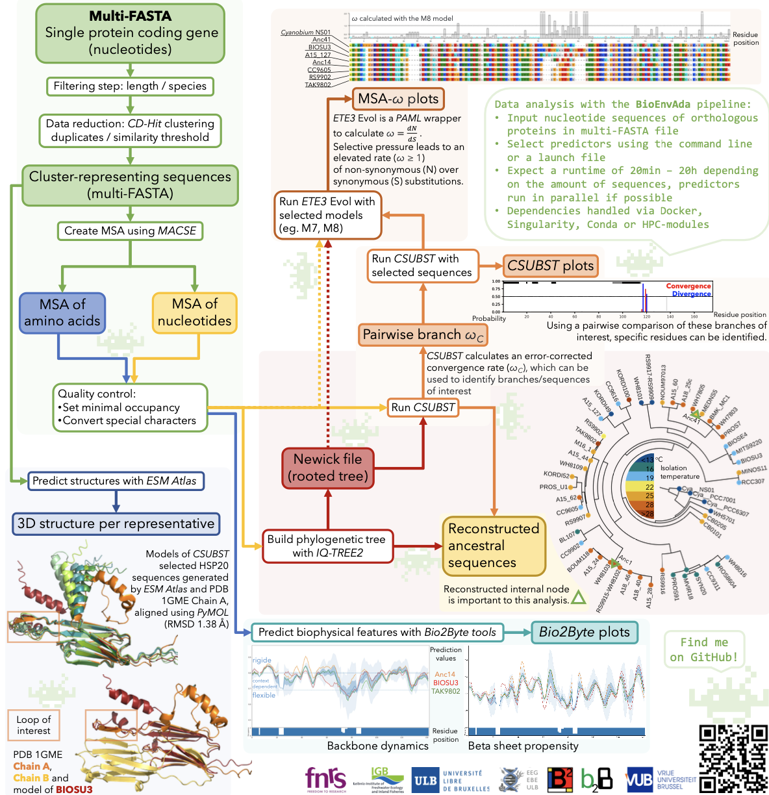

# BioEnvAda

The analysis of protein evolution requires many steps and tools, starting from collecting DNA data to predicting protein structure. 
We developed a NextFlow (BioEnvAda) pipeline to investigate protein adaptation to changing environmental conditions. It considers multiple aspects of protein evolution comparing changes in amino acid sequences while considering both phylogenetic information and measures of evolutionary pressure. It calculates tendencies for specific biophysical behaviours accounting for the local sequence environments and incorporates predicted 3D structures of a protein.

## Quickstart 

The default for all parameters in BioEnvAda is false. If you want to use a predictor, add the flag to the command line to turn it on.

Usage in commad line:

 nextflow run pipeline.nf \
    -profile standard,withdocker \
    --targetSequences ../input_example.fasta \
    --type 'aa' or 'nuc' \
    --qc \ 
    --clustering 0.85\
    --relabel \
    --alignSequences \
    --efoldmine \
    --disomine \
    --agmata \
    --fetchStructures \
    --buildTreeEvo \   
    --outGroup 'Species name to root your tree on' \
    --csubst \
    --branchIds '1,2,3'\
    --eteEvol 'M7,M8' \
    --selectedProteins 'your,proteins,as,str' \
    --plotBiophysicalFeatures \
    --buildLogo \
    --plotTree \
	-resume

Alternatively, adapt launch file run_nf.sh

The launch file also provides an extensive log file with the execution hash (e.g. 29f47dd0-59d1-4ca5-a602-00e10b693b31)to resume past jobs.
Add -resume to restart the last job or -resume execution_hash to restart any older job.
This can be used to restart jobs that crashed, but also to create plots with different highlighted proteins or different selected branches for csubst, without the need to recalculate all other steps.

## List of parameters

### INPUT FILES

- Input file: 		--targetSequences path/to/data/file
- Input file type: 	--type  nuc  
    - NOTE: For input of amino acid sequences use 'aa'
    
### FILTERING

- Set minimal ooccupancy of position in MSA: 		--qc 
    - NOTE:
    - --qc to remove empty columns in alignment
	- --qc 0.85 to set minial occupancy                        
- Clustering with CD-Hit: 						--clustering 1
	- NOTE: 
    - --clustering to remove duplicate sequences
	- --cluster 0.85 to set similarity cutoff 
- Adapt labels to clustering:						--relabel

### PREDICTORS

- Align sequences --alignSequences true
	- NOTE: 	
    - –-type aa: residue based MSA with Clustal
	- --type nuc: nucleotide based MSA with MACSE 
	- remove flag to keep pre-aligned file 

- DynaMine : ALWAYS
- DisoMine :					--disomine
- EFoldMine :					--efoldmine
- AgMata :					--agmata

Fetch structures using ESM Atlas (--fetchStructures): false

- Phylo. Tree :				--buildTreeEvo
- Species name to root your tree on :	--outGroup partialSpeciesID
- Csubst :					--csubst
- CsubstSite :				--branchIds 1,5
- EteEvol :					--eteEvol M7,M8

### OUTPUT FILES

- Proteins to be highlighted in the plots: --selectedProteins AncNode14,Syn_BIOS_U3
- Plot B2btools :							 --plotBiophysicalFeatures  
- Logo :									 --buildLogo
- Phylo. Tree plot :						 --plotTree
